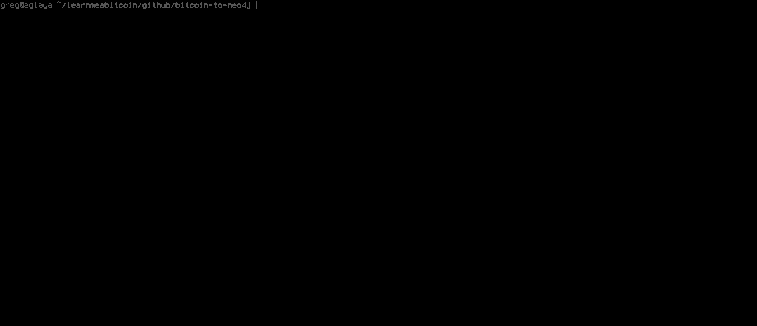

# Bitcoin to Neo4j


_See the [cypher examples](docs/cypher.md) for cool screenshots._

## Summary.

This script _runs through_ a **bitcoin blockchain** and inserts it in to a **Neo4j graph database**.

I use this script to power my bitcoin blockchain browser: <http://learnmeabitcoin.com/browser> 

**Important:**

* **The resulting Neo4j database is roughly _6x_ the size of the blockchain.** So if the blockchain is 100GB, your Neo4j database will be **600GB**.
* **It may take 60+ days to finish importing the entire blockchain.** Instead of doing a bulk import of the entire blockchain, this script runs through each `blk.dat`<sup>[1](#blkdat)</sup> file and inserts each block and transaction it encounters. So whilst it takes "a while" for an initial import, when it's complete it will continuously add new blocks as they arrive.

Nonetheless, you can still [browse](docs/cypher.md) whatever is in the database whilst this script is running.

## Install.

I have only used this on **Linux (Ubuntu)**.

It should work on OSX and Windows, but I haven't got installation instructions for those.

### Software.

This script makes use of the following software: 

1. **[Bitcoin Core](https://bitcoin.org/en/download)**

```bash
sudo add-apt-repository ppa:bitcoin/bitcoin
sudo apt update
sudo apt install bitcoind
```

2. **[Neo4j 4.0+](https://neo4j.com/)**

```bash
sudo add-apt-repository ppa:webupd8team/java
sudo apt update
sudo apt install oracle-java8-installer

wget -O - https://debian.neo4j.org/neotechnology.gpg.key | sudo apt-key add -
echo 'deb https://debian.neo4j.org/repo stable/' | sudo tee /etc/apt/sources.list.d/neo4j.list
sudo apt update && sudo apt install neo4j
```

3. **[PHP 8.0+](http://php.net/)** - The main script and it's library functions are written in PHP.

```bash
# The following php-* libraries are required for this script to run
sudo apt install php php-dev php-gmp php-curl php-bcmath php-mbstring
```

4. **[Redis 5.0.3+](https://redis.io/)** - This is used for storing the state of the import, so that the script can be stopped and started at any time.

```bash
sudo apt install build-essential
sudo apt install redis-server
```

### Dependencies.

**1. [neo4j-php-client](https://github.com/neo4j-php/neo4j-php-client)** (install via [composer](https://getcomposer.org/doc/00-intro.md)).

This is the driver that allows PHP to connect to your Neo4j database. I have included a `composer.json` file, so navigate to the project's home directory and install it with:

```bash
composer install
```

**2. [phpredis](https://github.com/phpredis/phpredis)**

This allows PHP to connect to Redis. These instructions should install the version needed for _PHP7_ (which is different to the default installation instructions that come with phpredis, which is aimed at PHP5).

```bash
# Install phpredis
sudo apt install php-redis
```

### Config.

The `config.php` file contains all the configuration settings. You probably only need to change:

1. The location of your `~/.bitcoin/blocks` folder 
2. Your Neo4j username and password.

```php
define("BLOCKS", '/home/user/.bitcoin/blocks'); // the location of the blk.dat files you want to read
define("TESTNET", false); // are you reading blk.dat files from Bitcoin's testnet?

define("NEO4J_USER", 'neo4j');
define("NEO4J_PASS", 'neo4j');
define("NEO4J_IP", 'localhost');    
define("NEO4J_PORT", '7687'); // this is the port used for the bolt protocol

define("REDIS_IP", 'localhost');    
define("REDIS_PORT", '6379');

```

## Run.

Make sure Neo4j is running (`sudo service neo4j start`), then start running the script with:

```
php main.php
```

This will start importing in to Neo4j, printing out the results as it goes.

[](docs/images/stdout.gif)

Here's an [annotated explanation of the results](docs/images/stdout-explained.png)

### Tip:

**You can stop and restart the script at any time, as the script stores its position using Redis.**

The script sets the following keys in Redis:

* `bitcoin-to-neo4j` - This stores the number of the current blk.dat file, and it's position in that file.
* `bitcoin-to-neo4j:orphans` - This stores the blockhashes of orphan blocks. You see, the blocks in the blk.dat files are not stored in order (based on their height), so by saving blocks that we cannot calculate a height for yet (because we haven't encountered the block it builds upon), we are able set the height later on.
* `bitcoin-to-neo4j:tip` - This is the height of the current longest chain we have got in Neo4j. It's not needed for the script to work, but it's useful for seeing the progress of the script.
* `bitcoin-to-neo4j:log` - Logs showing the amount of time that the blkXXXXX.dat files took to be imported.

When Redis is installed, you can look at each of these with:

```bash
redis-cli hgetall bitcoin-to-neo4j
redis-cli hgetall bitcoin-to-neo4j:orphans
redis-cli hgetall bitcoin-to-neo4j:tip
redis-cli hgetall bitcoin-to-neo4j:log
```

## FAQ

### How can I query this database?

Here are some [example cypher queries](docs/cypher.md), including some screenshots.

### What are the hardware requirements?

1. A really ****ing big SSD.

Other than that, I run this on my _Thinkpad X220_ (8GB Ram, 4x2.60GHz CPU) without any problems. It took about 2 weeks to import the full _testnet_ blockchain (50GB total), but my laptop didn't explode.

However, if you want to help things along:

* Make sure you're using an **SSD** for fast write speeds.
* Give as much **RAM** to Neo4j as possible. This helps with looking up existing nodes in the database, which this script does continually as it merges new transactions on to old ones.
    * Heap Size: I think a minimum 4GB does the trick.
    * Page Cache: Whatever RAM you have got left over.

CPU isn't much of a factor in comparison to RAM and a fast disk.

_See [Neo4j Performance](http://neo4j.com/docs/operations-manual/current/performance/) for more details._

### How big is this graph database?

It's constantly growing, but as of 17 May 2017 (blockchain height: 466,874, blockchain size: 114GB):

* Nodes: 1,587,199,550 
* Relationships: 2,503,359,310
* Size: 625 GB

### Does this import the _entire_ blockchain?

Yes, no data is left behind. If you really wanted to you could convert the data back in to binary as it is found in the raw `blk.dat` files.

For example, the "serialized" transaction data<sup>[2](#transaction-data)</sup>  on my explorer is actually data from the graph converted back in to it's original format: [Transaction: be56667fed4336efc08c6a1addfba0008169861af906e7f436ffcc86935d2b2e](http://learnmeabitcoin.com/browser/transaction/be56667fed4336efc08c6a1addfba0008169861af906e7f436ffcc86935d2b2e) _(click on "serialized" in the top-right)_

### Why doesn't this use Neo4j's _Bulk Import Tool_?

Because I needed a script that would add blocks as they arrived.

It would involve writing another tool for a bulk import. I haven't tried.

### Why is this written in PHP?

Because it's the language I knew best when I started this.

Or in other words, I'm not the king of programming, and PHP does the job.

## Footnotes

* <a name="blkdat">1</a>: <http://learnmeabitcoin.com/glossary/blkdat>
* <a name="transaction-data">2</a>: <http://learnmeabitcoin.com/glossary/transaction-data>
