# How to Import the Blockchain in to Neo4j

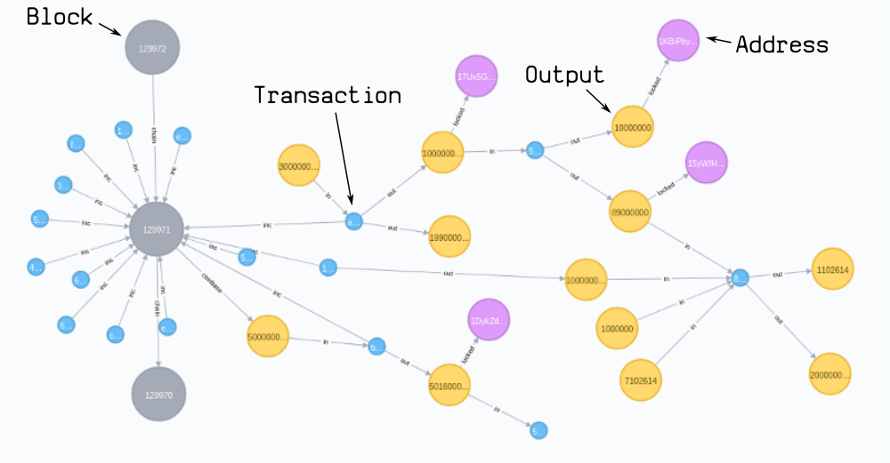

This guide runs through the _basic_ steps for **importing the bitcoin blockchain in to a Neo4j graph database**.

The whole process is just about taking data from one format (blockchain data), and converting it in to another format (a graph database). The only thing that makes this slightly trickier than typical data conversion is that it's _helpful_ to understand of the structure of bitcoin data before you get started.

However, once you have imported the blockchain in to Neo4j, you can perform analysis on the graph database that would not be possible with SQL databases. For example, you can **follow the path of bitcoins to see if two different addresses are connected**:

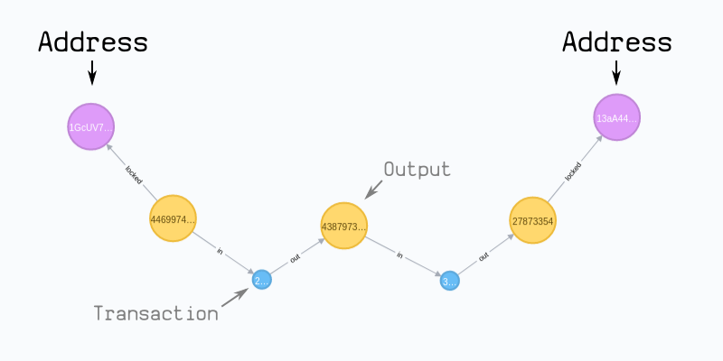

In this guide I will cover:

1. How bitcoin works, and what the blockchain is.
2. What blockchain data looks like.
3. How to import the blockchain data in to Neo4j.

This isn't a complete tutorial on how to write your own importer tool. However, if you're interested, you look at my [bitcoin-to-neo4j](https://github.com/in3rsha/bitcoin-to-neo4j) code, although I'm sure you could write something cleaner after reading this guide.


## 1. What is Bitcoin?

Bitcoin is a computer program.

It's a bit like uTorrent; you run the program, it _connects to other computers_ running the same program, and it _shares a file_. However, the cool thing about Bitcoin is that _anyone can add data_ to this shared file, and any data already written to the file _cannot be tampered with_.

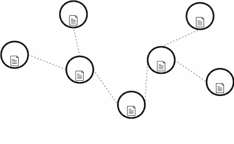

As a result, Bitcoin creates a **secure file** that is shared on a **distributed network**.

### What can you do with this?

Well, in Bitcoin, each piece of data that gets added to this file is a **transaction**. Therefore, this decentralised file is being used as a "ledger" for a _digital currency_.

This ledger is called **the blockchain**.

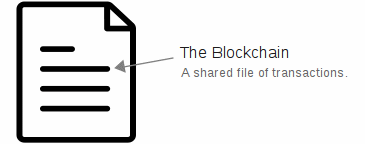

### Where can I find the blockchain?

If you run the [Bitcoin Core](https://bitcoin.org/en/download) program, the blockchain will be stored in a folder on your computer:

* Linux: `~/.bitcoin/blocks`
* Windows: `~/Library/Application Support/Bitcoin/blocks`
* Mac: `C:\Users\YourUserName\Appdata\Roaming\Bitcoin\blocks`

**NOTE:** When you open this directory you should notice that instead of one big file, you will find multiple files with the name `blkXXXXX.dat`. This is the blockchain data, but split across multiple smaller files.


## 2. What does the blockchain look like?

The [blk.dat](https://learnmeabitcoin.com/technical/blkdat) files contain serialized data of **blocks** and **transactions**.

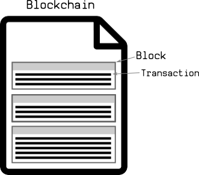

### Blocks

Blocks are separated by [magic bytes](https://learnmeabitcoin.com/technical/magic-bytes), which is then followed by the _size_ of the upcoming block.

Each block then begins with a [block header](https://learnmeabitcoin.com/technical/block-header):

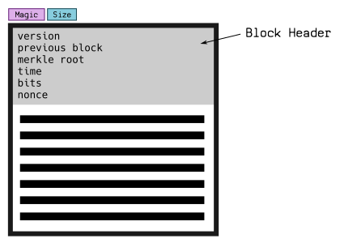

#### Block Header Example:

```
{
  "version": 00000020,
  "previousblock": "6c77f112319ae21489b66774e8acd379044d4a23ea7498000000000000000000",
  "merkleroot": "821fe1890186779b2cc232d5dbecfb9119fd46f8a9cfd1141649ff1cd9073744",
  "time": 87d8ae59,
  "bits": "e93c0118",
  "nonce": 32ec0399,
}
```

### Transactions

After the block header, there is a byte that tells you the upcoming number of transactions in the block. After that, you get serialized transaction data, one after the other.

A [transaction](https://learnmeabitcoin.com/technical/transaction-data) is just another piece of code again, but they are more structurally interesting.

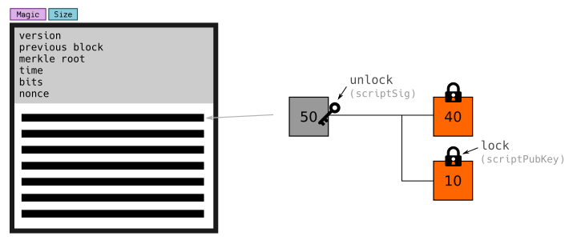

Each transaction has the same pattern:

1. Select Outputs (we call these _Inputs_).
    * _Unlock_ these inputs so that they can be spent.
2. Create Outputs
    * _Lock_ these outputs to a new address.

So after a series of transactions, you have a transaction structure that looks like something this:

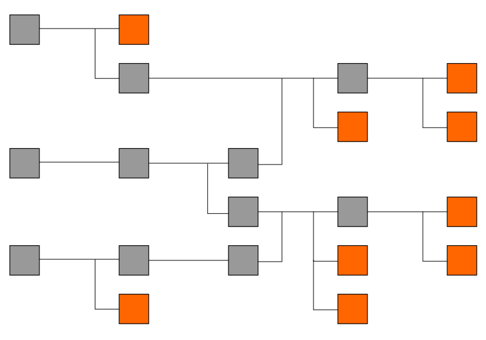


#### Transaction Example:

```
{
  "version": "02000000",
  "inputcount": "01",
  "inputs": [
    {
      "txid": "f2f7ee9dda0ba82031858d30d50d3205eea07246c874a0488532014d3b653f03",
      "vout": "00000000",
      "scriptsigsize": "6a",
      "scriptsig": "47304402204df1839028a05b5b303f5c85a66affb7f6010897d317ac9e88dba113bb5a0fe9022053830b50204af15c85c9af2b446338d049672ecfdeb32d5124e0c3c2256248b7012102c06aec784f797fb400001c60aede8e110b1bbd9f8503f0626ef3a7e0ffbec93b",
      "sequence": "feffffff"
    }
  ],
  "outputcount": "02",
  "outputs": [
    {
      "amount": "00e1f50500000000",
      "scriptpubkeysize": "19",
      "scriptpubkey": "76a9144120275dbeaeb40920fc71cd8e849c563de1610988ac"
    },
    {
      "amount": "9f16641800000000",
      "scriptpubkeysize": "19",
      "scriptpubkey": "76a91493fa3301df8b0a268c7d2c3cc4668ea86fddf81588ac"
    }
  ],
  "locktime": "61610700"
}
```


## 3. How to import the blockchain in to Neo4j.

Well, now we know what the blockchain data represents (and that it looks a lot like a graph), we can go ahead and import it in to Neo4j. We do this by:

1. Reading through the blk.dat files.
2. Decoding each block and transaction we run in to.
3. Converting the decoded block/transaction in to a Cypher query.

Here's a visual guide to how I represent **Blocks**, **Transactions**, and **Addresses** in the database:

### Blocks

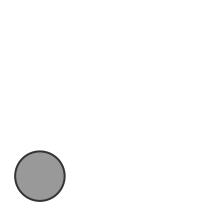

1. CREATE a `:block` node, and connect it to the previous block it builds upon.
    * SET each field from the **block header** as _properties_ on this node.
3. CREATE a `:coinbase` node coming off each block, as this represents the "new" bitcoins being made available by the block.
    * SET a **value** property on this node, which is equal to the block reward for this block.

### Transactions

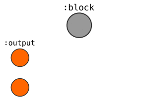

1. CREATE a `:tx` node, and connect it to the `:block` we had just created.
    * SET properties (**version**, **locktime**) on this node.
2. MERGE existing `:output` nodes and relate them `[:in]` to the `:tx`.
    * SET the **unlocking** code as a property on the relationship.
3. CREATE new `:output` nodes that this transaction creates.
    * SET the respective **values** and **locking** codes on these nodes.

#### Addresses

If the **locking** code on an `:output` contains an address...

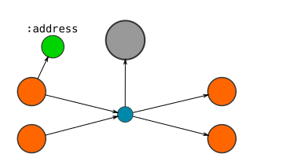

1. CREATE an `:address` node, and connect the output node to it.
    * SET the **address** as a property on this node.
    * _Note: If different outputs are connected to the same address, then they will be connected to the same address node._


## 4. Cypher Queries

Here are some example cypher queries you could use for the basis of inserting blocks and transactions in to Neo4j.

**NOTE:** You will need to decode the **block headers** and **transaction data** to get the _parameters_ for the cypher queries.

### Block

```cypher
MERGE (block:block {hash:$blockhash})
CREATE UNIQUE (block)-[:coinbase]->(:output:coinbase)
SET
   block.size=$size,
   block.prevblock=$prevblock,
   block.merkleroot=$merkleroot,
   block.time=$timestamp,
   block.bits=$bits,
   block.nonce=$nonce,
   block.txcount=$txcount,
   block.version=$version,

MERGE (prevblock:block {hash:$prevblock})
MERGE (block)-[:chain]->(prevblock)
```

#### Parameters (example):
```json
{
    "blockhash": "00000000000003e690288380c9b27443b86e5a5ff0f8ed2473efbfdacb3014f3",
    "version": 536870912,
    "prevblock": "000000000000050bc5c1283dceaff83c44d3853c44e004198c59ce153947cbf4",
    "merkleroot": "64027d8945666017abaf9c1b7dc61c46df63926584bed7efd6ed11a6889b0bac",
    "timestamp": 1500514748,
    "bits": "1a0707c7",
    "nonce": 2919911776,
    "size": 748959,
    "txcount": 1926,
}
```

### Transaction

```cypher
MATCH (block :block {hash:$hash})
MERGE (tx:tx {txid:$txid})
MERGE (tx)-[:inc {i:$i}]->(block)
SET tx += {tx}	  

WITH tx
FOREACH (input in $inputs |
		 MERGE (in :output {index: input.index})
		 MERGE (in)-[:in {vin: input.vin, scriptSig: input.scriptSig, sequence: input.sequence, witness: input.witness}]->(tx)
		 )

FOREACH (output in $outputs |
		 MERGE (out :output {index: output.index})
		 MERGE (tx)-[:out {vout: output.vout}]->(out)
		 SET
		     out.value= output.value,
		     out.scriptPubKey= output.scriptPubKey,
		     out.addresses= output.addresses
		 FOREACH(ignoreMe IN CASE WHEN output.addresses <> '' THEN [1] ELSE [] END |
				 MERGE (address :address {address: output.addresses})
				 MERGE (out)-[:locked]->(address)
				 )
		 )
```

_Note: This query uses the [FOREACH hack](http://www.markhneedham.com/blog/2016/10/30/neo4j-create-dynamic-relationship-type/), which acts as a conditional and will only create the `:address` nodes if the `$addresses` parameter actually contains an address (i.e. is not empty)._

#### Parameters (example):

```json
{
    "txid": "2e2c43d9ef2a07f22e77ed30265cc8c3d669b93b7cab7fe462e84c9f40c7fc5c",
    "hash": "00000000000003e690288380c9b27443b86e5a5ff0f8ed2473efbfdacb3014f3",
    "i": 1,
    "tx": {
        "version": 1,
        "locktime": 0,
        "size": 237,
        "weight": 840,
        "segwit": "0001"
    },
    "inputs": [
        {
            "vin": 0,
            "index": "0000000000000000000000000000000000000000000000000000000000000000:4294967295",
            "scriptSig": "03779c110004bc097059043fa863360c59306259db5b0100000000000a636b706f6f6c212f6d696e65642062792077656564636f646572206d6f6c69206b656b636f696e2f",
            "sequence": 4294967295,
            "witness": "01200000000000000000000000000000000000000000000000000000000000000000"
        }
    ],
    "outputs": [
        {
            "vout": 0,
            "index": "2e2c43d9ef2a07f22e77ed30265cc8c3d669b93b7cab7fe462e84c9f40c7fc5c:0",
            "value": 166396426,
            "scriptPubKey": "76a91427f60a3b92e8a92149b18210457cc6bdc14057be88ac",
            "addresses": "14eJ6e2GC4MnQjgutGbJeyGQF195P8GHXY"
        },
        {
            "vout": 1,
            "index": "2e2c43d9ef2a07f22e77ed30265cc8c3d669b93b7cab7fe462e84c9f40c7fc5c:1",
            "value": 0,
            "scriptPubKey": "6a24aa21a9ed98c67ed590e849bccba142a0f1bf5832bc5c094e197827b02211291e135a0c0e",
            "addresses": ""
        }
    ]
}
```


## 5. Results

If you have inserted the blocks and transactions using the cypher queries above, then these are some examples the kind of results you can get out of the graph database.

### Block

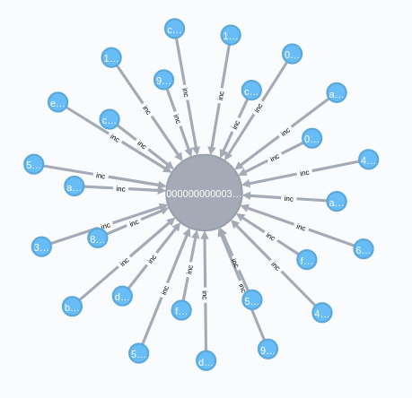

```
MATCH (block :block)<-[:inc]-(tx :tx)
WHERE block.hash='$blockhash'
RETURN block, tx
```

### Transaction

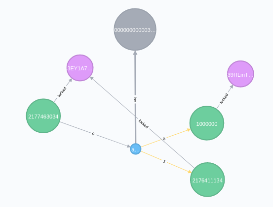

```
MATCH (inputs)-[:in]->(tx:tx)-[:out]->(outputs)
WHERE tx.txid='$txid'
OPTIONAL MATCH (inputs)-[:locked]->(inputsaddresses)
OPTIONAL MATCH (outputs)-[:locked]->(outputsaddresses)
OPTIONAL MATCH (tx)-[:inc]->(block)
RETURN inputs, tx, outputs, block, inputsaddresses, outputsaddresses
```

### Address

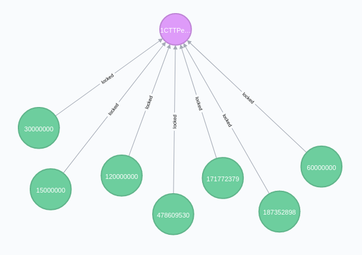

```
MATCH (address :address {address:'1PNXRAA3dYTzVRLwWG1j3ip9JKtmzvBjdY'})<-[:locked]-(output :output)
WHERE address.address='$address'
RETURN address, output
```

### Paths

Finding paths between transactions and addresses is probably the most interesting thing you can do with a graph database of the bitcoin blockchain, so here are some examples of cypher queries for that:

#### Between Outputs

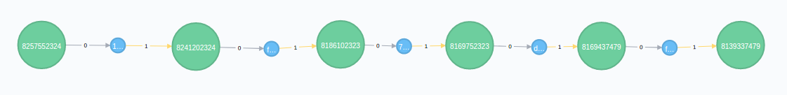

```
MATCH (start :output {index:'$txid:vout'}), (end :output {index:'$txid:out'})
MATCH path=shortestPath( (start)-[:in|:out*]-(end) )
RETURN path
```

#### Between Addresses

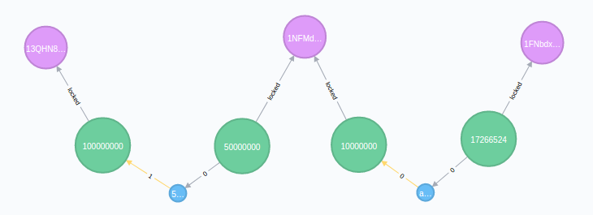


```
MATCH (start :address {address:'$address1'}), (end :address {address:'$address2'})
MATCH path=shortestPath( (start)-[:in|:out|:locked*]-(end) )
RETURN path
```


## 6. Conclusion

This has been a simple guide on how you can take the blocks and transactions from blk.dat files (the blockchain) and import them in to a Neo4j database.

I think it's worth the effort if you're looking to do serious analysis on the blockchain. A graph database is a natural fit for bitcoin data, whereas using an SQL database for bitcoin transactions feels like trying to shove a square peg in to a round hole.

I've tried to keep this guide compact, so I haven't covered things like:

1. **Reading through the blockchain.** Reading the [blk.dat](https://learnmeabitcoin.com/technical/blkdat) files is easy enough. However, the annoying thing about these files is that the **blocks are [not written to these files in sequential order](https://bitcoin.stackexchange.com/questions/41535/how-much-out-of-order-are-the-blocks-stored-in-the-blk-dat-files)**, which makes _setting the height on a block_ or _calculating the fee for a transaction_ a bit trickier (but you can code around it).
2. **Decoding blocks and transactions.** If you want to use the **cypher queries** above, you will need to get the _parameters_ you require by decoding the block headers and raw transaction data as you go. You could write your own decoders, or you could try using an existing bitcoin library.
3. **Segregated Witness**. I've only given a cypher query for an "original" style transaction, which was the only transaction structure used up until block [481,824](https://learnmeabitcoin.com/explorer/blockchain/481824). However, the structure of a [segwit transaction](https://learnmeabitcoin.com/explorer/transaction/c586389e5e4b3acb9d6c8be1c19ae8ab2795397633176f5a6442a261bbdefc3a) is only slightly different (but it might need its own cypher query).

Nonetheless, hopefully this guide has been somewhat helpful.

But as always, if you understand how the data works, converting it to a different format is just a matter of sitting down and writing the tool.

Good luck.
